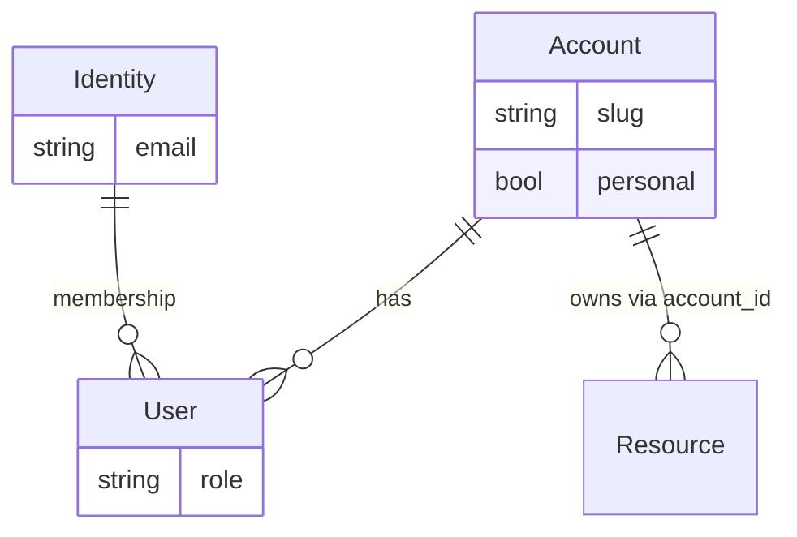
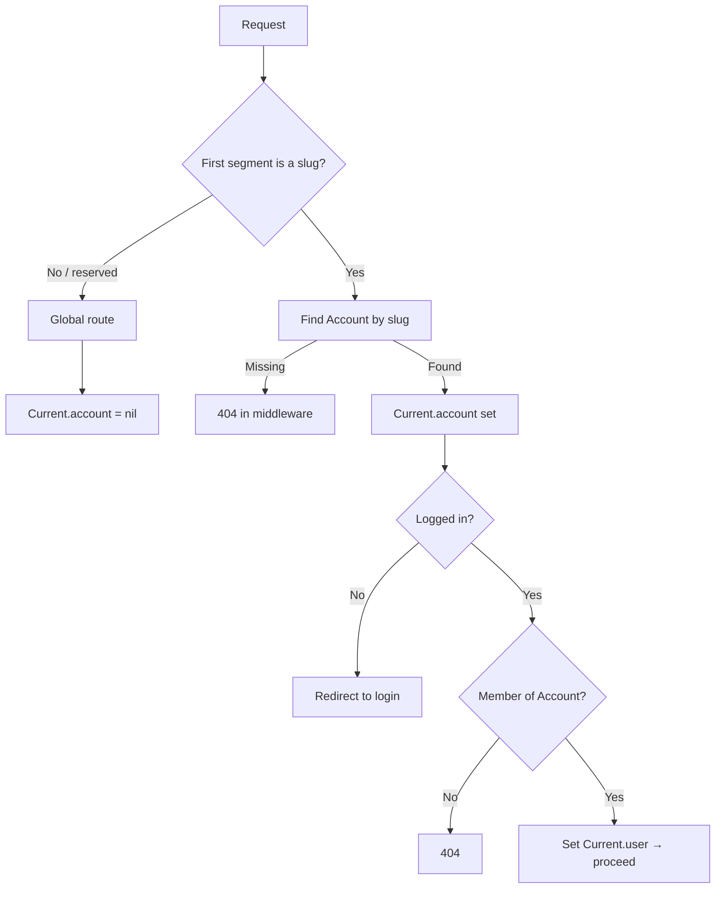
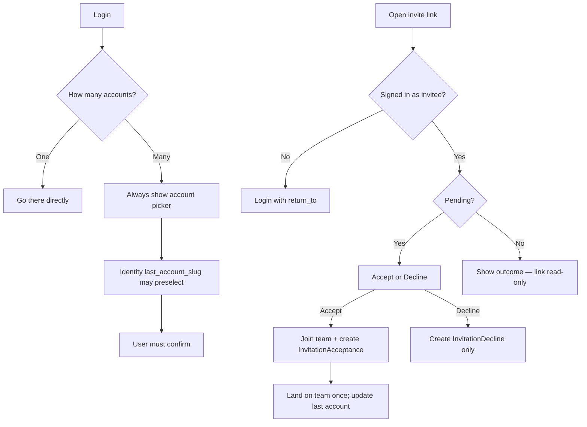

# Account

Canonical account / tenancy design for MonoSolo. Follow this doc for product behavior and agent changes.

**Account** is the tenant boundary. Membership is a **User** linking **Identity** ↔ **Account**. Tenant data carries `account_id` and is used when `Current.account` is set. Global routes keep `Current.account` nil.

## At a glance

### Mental model



| Piece        | Role                                                                 |
| ------------ | -------------------------------------------------------------------- |
| **Identity** | Global login (email / session). Not a tenant. No slug.               |
| **Account**  | Tenant — personal or team. Owns the URL slug and data.               |
| **User**     | Membership inside an Account (roles, access).                        |
| **Resource** | Any tenant-owned record; always scoped by `account_id`.              |

### URL shape

Personal and team accounts share one namespace:

```text
/{slug}/users
/{slug}/settings
```

Type is decided after lookup (`personal?` / `team?`), not by a URL prefix. The UI may call a personal slug “username”; the domain term is still **Account slug**.

### Request flow



Middleware only resolves the Account. Login and membership checks live in controllers / concerns.

### After login / invite



Invite links live at `/{slug}/invitations/:token`. Accepting adds team membership and creates an `Account::InvitationAcceptance` record; declining creates `Account::InvitationDecline`. The **Invitation row is kept** — state comes from those response records, not `accepted_at` / `declined_at` columns. At most one response per invitation (acceptance **or** decline). After a response the link is read-only. Email uniqueness on invitations is **pending-only**, so a declined address can be invited again. The personal Account already exists from signup; invite accept only adds team membership.

### Golden rules

1. **Account** is the only tenant boundary; tenant models use `account_id`.
2. Personal and team share one slug namespace and the same `/{slug}/...` URL shape.
3. Every Identity has exactly one personal Account — eager-created on signup, never deleted.
4. Global routes keep `Current.account` nil. Identity `last_account_slug` is picker hint only — never silent tenant context.
5. Missing Account or non-member → **404**. Unauthenticated on a slug route → login with `return_to`.
6. Slug rename releases the old name immediately (no redirects). Prefer stable Account ids for long-lived API clients.
7. API: path slug wins over `X-Account-Slug`; if neither, fall back to personal.

---

## Reference

### Language

| Term                 | Meaning                                                                                          |
| -------------------- | ------------------------------------------------------------------------------------------------ |
| **Account**          | Tenant boundary — personal or team. Prefer over organization / workspace / team as domain nouns. |
| **Personal account** | Single-Identity Account. Always exists, undeletable, has a slug (`/{slug}/...`).                 |
| **Team account**     | Multi-user Account. Same URL shape as personal.                                                  |
| **Account slug**     | Path segment for any Account in the shared namespace. UI may say “username” for personal.       |
| **Identity**         | Global login principal. Not an Account; does not occupy the slug namespace.                      |
| **User**             | Membership record: Identity ↔ Account (+ role / access).                                         |

### Slug

- Format: `4..16` chars, `[a-zA-Z0-9_-]`, unique across personal and team.
- Reserved prefixes live in `AccountSlug::RESERVED_SLUGS` — keep in sync with `routes.rb`.
- **Initial**: derive from email local-part or display name and always append 4 random digits (`john` → `john8472`).
- **Rename**: allowed for personal and team. Old slug is not redirected; it is held for 30 days so others cannot claim it; warn in settings.
- `PATH_INFO_MATCH` requires the slug to end at `/` or EOS so longer segments (e.g. `invitations`) are never truncated into a fake slug.

### Lifecycle

- Registration **eager-creates** the personal Account.
- **Invitations**: `/{slug}/invitations/:token` (show). Accept via `POST .../acceptance`; decline via `POST .../decline`. Both create dedicated response records and **retain** the invitation row.
- **Invitation state**: `pending?` / `accepted?` / `declined?` derived from `Account::InvitationAcceptance` or `Account::InvitationDecline` (timestamps on those records). One response per invitation — never both.
- **Re-invite**: email uniqueness scoped to pending invitations only; declined emails can receive a new invite.
- Invite accept adds team membership and first landing; decline does not join.
- Personal Account: rename / display only — **cannot delete**.
- Team Account: normal leave / delete rules for owners.

### Request pipeline

**Middleware** (`AccountSlug::Extractor`):

1. If the first path segment looks like a slug and is not reserved → move it to `SCRIPT_NAME`, leave the rest as `PATH_INFO` (route helpers stay unprefixed).
2. `Account.find_by(slug:)` and wrap in `Current.with_account(account)`.
3. Slug present but Account missing → **404 in middleware**.

**Global routes** (no slug): `/login`, account picker, `/my/...`, marketing.

- `Current.account` stays nil.
- Do not treat session “last account” as tenant context on these routes.

**Authorization** (controllers / concerns — not middleware):

| Situation                         | Behavior                                      |
| --------------------------------- | --------------------------------------------- |
| Account exists, unauthenticated   | Redirect to login with `return_to`            |
| Authenticated, not a member       | **404** (same shape as missing; avoid 403 leak) |
| Authenticated member              | Proceed; set `Current.user`                   |

### API

Support both:

1. Path aligned with Web: `/api/v1/{slug}/...`
2. Header `X-Account-Slug` (or token claim) when the path has no slug

**Resolution** (path wins):

| Path slug | Header  | Result                              |
| --------- | ------- | ----------------------------------- |
| Present   | Absent  | Use path                            |
| Absent    | Present | Use header                          |
| Present   | Present | **Use path; ignore header**         |
| Absent    | Absent  | Fall back to **personal** Account   |

Invalid slug → 404. Non-member → 404.

### Creating account-scoped resources

Include `account:references` when generating tenant models:

```bash
rails generate model Post title:string body:text account:references
```

That adds `account_id`, `belongs_to :account`, and proper scoping.

### Implementation touchpoints

- [`core/config/initializers/account_slug.rb`](../../core/config/initializers/account_slug.rb) — middleware, reserved slugs, API path / header
- `Identity` / signup / invite flows — eager personal; invite first hop
- `Current` / session — no personal fallback on global nil-account routes
- Auth concerns — unauthenticated → login; non-member → 404
- Account settings — slug rename warning; personal undeletable
- [`DEVELOP.md`](DEVELOP.md) — multi-tenancy overview aligned with this doc

### References

- [Jumpstart Rails - Accounts](https://jumpstartrails.com/docs/accounts)
- [Bullet Train - Teams Should Be an MVP Feature](https://blog.bullettrain.co/teams-should-be-an-mvp-feature/)
