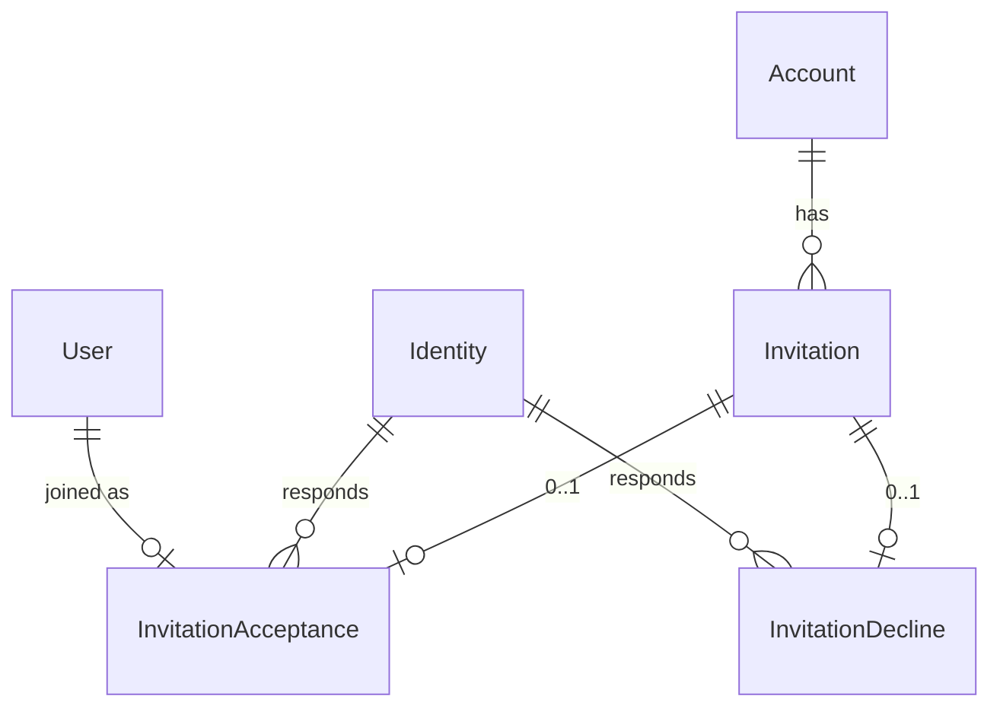

# Invitation acceptance & decline records

Date: 2026-08-03  
Status: draft (awaiting review)  
Branch context: `core/account-slug`

## Goal

Keep invitation links at `/{slug}/invitations/:token`. Accepting or declining an invitation **keeps the Invitation row** and creates a dedicated response record. State is derived from that record — no `accepted_at` / `declined_at` columns on Invitation.

## Decisions

| Topic | Choice |
| ----- | ------ |
| Invitation URL | `/{slug}/invitations/:token` (show) |
| Accept action | `POST .../invitations/:token/acceptance` |
| Decline action | `POST .../invitations/:token/decline` |
| Response models | `Account::InvitationAcceptance`, `Account::InvitationDecline` |
| Timestamps | Use response record `created_at` only |
| Cardinality | At most one response per invitation (acceptance **or** decline) |
| After response | Link is read-only; show outcome, no buttons |
| Re-invite | Allowed after decline: pending-only uniqueness on `(account_id, email)` |
| Actor | Acceptance: `identity` + `user` (after join). Decline: `identity` only |
| Join codes | Unchanged: `/{slug}/join/:code` → `Account::JoinController` |

## Domain model



### `Account::Invitation`

- Unchanged core fields: `account`, `invited_by`, `email`, `token`, …
- Associations: `has_one :acceptance`, `has_one :decline`
- Status helpers (no extra columns):
  - `pending?` — no acceptance and no decline
  - `accepted?` — acceptance present
  - `declined?` — decline present
- `accept` / decline flows **must not** `destroy!` the invitation
- Email uniqueness scoped to **pending** invitations only (so a declined invite does not block a new invite to the same email)

### `Account::InvitationAcceptance`

- `belongs_to :invitation` (unique index on `invitation_id`)
- `belongs_to :identity`
- `belongs_to :user` (membership created by join)
- `created_at` is the accepted-at time

### `Account::InvitationDecline`

- `belongs_to :invitation` (unique index on `invitation_id`)
- `belongs_to :identity`
- `created_at` is the declined-at time

### Invariants

1. An invitation may have an acceptance **or** a decline, never both.
2. Creating a second response for the same invitation fails (DB unique + app guard).
3. Accept still requires `Current.identity.email == invitation.email` (existing `EmailMismatch`).
4. Decline requires the same email match.

## Routes & controllers

Under `scope module: :account, as: :account`:

```ruby
resources :invitations, only: %i[index new create]
resources :invitations, param: :token, only: %i[show] do
  resource :acceptance, only: %i[create], controller: "invitation_acceptances"
  resource :decline, only: %i[create], controller: "invitation_declines"
end
```

| Controller | Role |
| ---------- | ---- |
| `Account::InvitationsController` | Admin index/new/create + public **show** (preview / outcome) |
| `Account::InvitationAcceptancesController` | `create` — join + build acceptance |
| `Account::InvitationDeclinesController` | `create` — build decline |

Show page behavior:

- Guest → login CTA + `return_to` invitation URL
- Signed-in wrong email → switch-login CTA
- Signed-in invitee + pending → Accept / Decline buttons
- Already accepted / declined → outcome only

Reserved slug list: keep `invitations`; drop standalone `acceptances` if no longer a top-level path.

## Out of scope

- Changing join-code redemption beyond the already-landed `JoinController`
- Listing historical acceptances/declines in admin UI (data is stored; UI can come later)
- Soft-delete / archive of invitations

## Migration sketch

- `account_invitation_acceptances`: `invitation_id` (unique), `identity_id`, `user_id`, timestamps
- `account_invitation_declines`: `invitation_id` (unique), `identity_id`, timestamps
- Adjust invitation email uniqueness to pending-only (partial unique index if the DB supports it; otherwise app-level validation matching current SQLite constraints strategy)

## Test plan

- Guest show still sets `return_to` to invitation URL
- Accept creates acceptance, joins account, keeps invitation, redirects into account
- Decline creates decline, does not join, keeps invitation
- Second accept/decline on resolved invitation → 404 or unprocessable
- Declined email can be invited again (new pending invitation)
- Wrong-email accept/decline still raises / redirects with mismatch
- Mismatched account slug + token → 404
